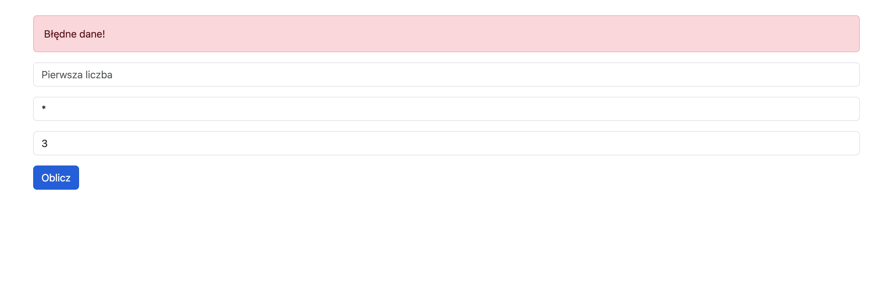

# Zadanie - JS 05

1. Odpal plik `index.html`

2. Dodaj kod w pliku JS tak aby po zatwierdzeniu formularza
    - strona się nie przeładowała
    - zostały pobrane wartości pól ( pamiętaj o zmianie liczb na number )
    - dane zostaly zwalidowane ( sprawdz czy liczby nie są `NaN` i czy operacja to jedna z `+`, `-`, `*`, `/` )
    - jeśli dane są poprawne, to powinien pojawić się komunikat z wynikiem ( Patrz screenshot nizej )
    - jeśli dane są błędne, to powinien pojawić się komunikat z napisem: `Błędne dane!`
    - Pamiętaj aby zdefiniować atrybuty `name` oraz `value` dla odpowiednich tagów HTML
    - Komunikat sukcesu stwórz w JS, wzroując się na takim HTML
        ```
        <div class="alert alert-success">1 * 3 = 3</div>
        ```
    - Komunikat błędu stwórz w JS, wzroując się na takim HTML
        ```
        <div class="alert alert-danger">Błędne dane!</div>
        ```
    - Aby dodać nowy element jako pierwszy w ramach elementu `form` skorzystaj z funkcji `formEl.prepend(...)`

3. Efekt końcowy po zatwierdzeniu formularza:
    
    